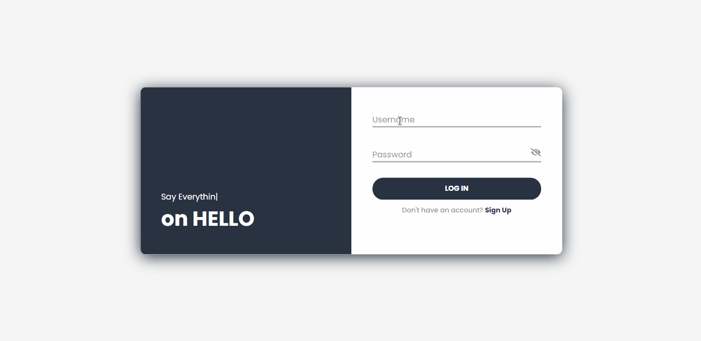
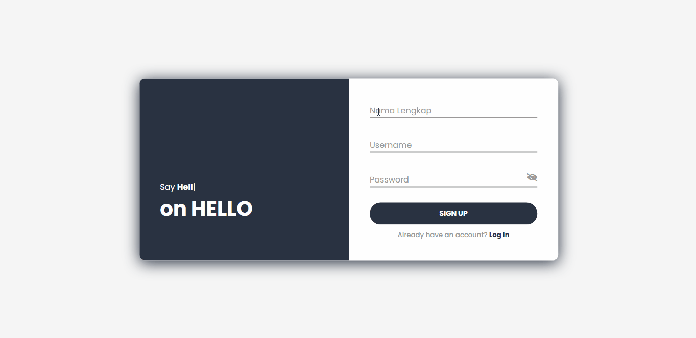
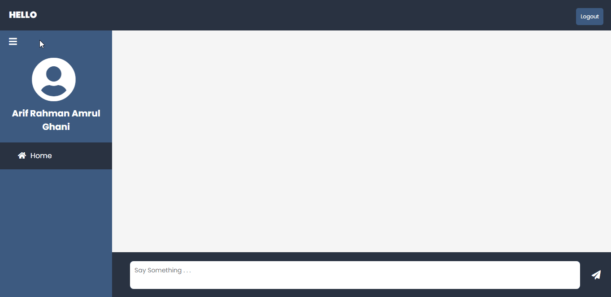
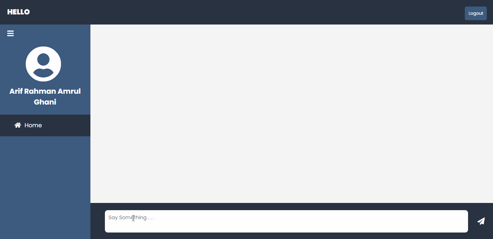
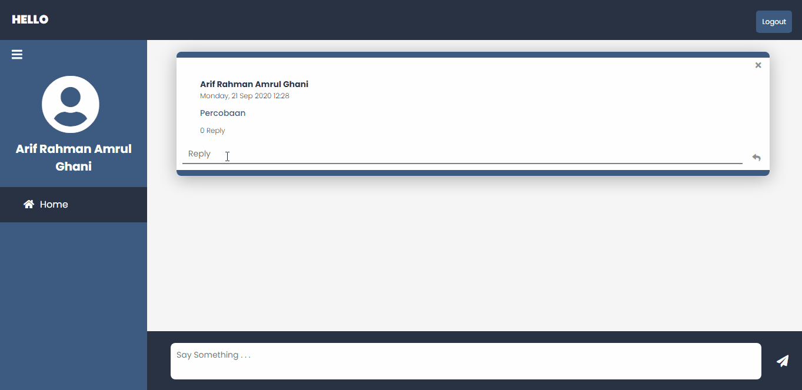
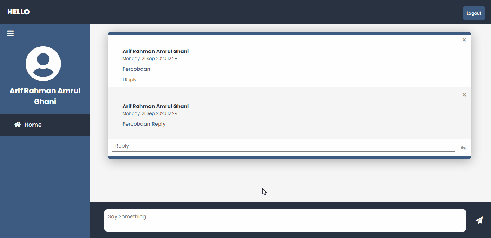

# PHP Exercise - Forum Website

## Deskripsi Singkat
Create a simple web application for facilitating discussion forum (similar to General channel at MS Team)

## Preview
1. Halaman Login

2. Halaman Sign Up

3. Halaman Home

4. Membuat Post

5. Reply pada Post

6. Menghapus Reply

7. Menghapus Post

8. Logout

